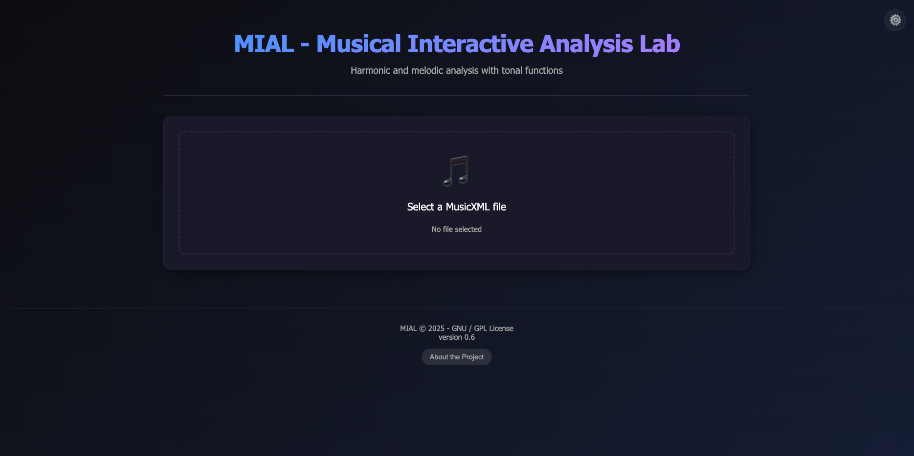

# MusicXML Score Analyzer with AI

A modern web application for MusicXML score analysis, combining traditional music theory with the power of Artificial Intelligence.

 *Note: Add a screenshot here if desired.*

## 🚀 Main Features

### 🎼 Musical Analysis
*   **MusicXML Upload:** Support for `.xml` and `.musicxml` files.
*   **General Information:** Automatic extraction of title, key, measures, instruments, and time signatures.
*   **Melodic Analysis:**
    *   Count of most common intervals.
    *   Melodic direction analysis (ascending/descending).
    *   Rhythmic analysis and note density.
*   **Harmonic Analysis:**
    *   Harmonic reduction based on selected instruments.
    *   Identification of chords and tonal functions (Roman numerals).
*   **Reports:** Detailed visualization in collapsible sections and export to TXT.

### 🎼 Professional Staff Notation Display
*   **Verovio Rendering:** Professional music engraving using Verovio Toolkit (WASM-based, deterministic MusicXML rendering)
*   **Continuous Horizontal Layout:** Render unlimited measures without page breaks
*   **Dynamic Zoom Controls:** Zoom from 20% to 200% with precise 10% increments
*   **Full Scroll Support:** Horizontal and vertical scrolling for large scores
*   **Responsive Rendering:** Adapts layout based on number of instruments and measures

### ⚖️ Instrument Comparison (NEW in v0.7)
*   **Multi-Instrument View:** Compare up to 5 instruments side-by-side
*   **Dual Visualization Modes:**
    *   **Piano Roll:** Visual timeline representation with all instruments aligned
    *   **Staff Notation:** Professional score notation with vertical alignment
*   **Interactive Controls:**
    *   Measure range selection (start/end)
    *   Zoom controls (20% to 200%)
    *   Full scrolling support
*   **AI Analysis Integration:** Analyze selected measure ranges with AI
*   **Musical Assistant Chatbot:** Real-time questions and clarifications about comparative analysis

### 🤖 AI Integration
*   **AI Panel:** Integrated into each report section for deep contextual analysis.
*   **Model Flexibility:**
    *   **Online:** Compatible with OpenAI (GPT-3.5, GPT-4, etc.).
    *   **Local:** Compatible with LM Studio, LocalAI, and Ollama.
*   **Customizable Prompts:** Prompt editor to save your favorite analysis instructions.
*   **Automatic Context:** The prompt sent to the AI automatically includes the section title and analyzed data.
*   **Comparison Analysis:** Dedicated prompts for comparative AI analysis

### 🔄 Advanced Analysis Tab
*   **Symmetry Analysis (Tonal vs Serial):**
    *   **Automatic Tonality Detection:** Upon file upload, the system detects the key center
    *   **Environment Selection:** Choose between Tonal (default) or Serial (12-tone) analysis
    *   **Tonal Mode:** Analyzes symmetry patterns relative to the tonic (key center)
        - Inversions calculated as: `(2 × tonic - pitch) mod 12`
        - Ideal for Western classical tonal music
    *   **Serial Mode:** Dodecaphonic analysis treating all 12 pitches equally
        - Uses music21 serial transformation methods
        - Ideal for atonal/serial music (Schoenberg, Berg, Webern)
    *   **Comprehensive Metrics:**
        - Retrograde (R): Reversed pitch sequence similarity
        - Inversion (I): Mirror transformation similarity
        - Retrograde-Inversion (RI): Combined transformation
    *   **Visual Feedback:** See detected tonality and current analysis mode
*   **Other Advanced Analyses:**
    *   Cadence detection, modulation tracking, voice leading
    *   Dissonance analysis, harmonic functions, phrase structure
    *   Texture analysis, chromatic analysis, complete statistics

### 🎨 Modern Interface
*   **Themes:** Toggle between **Dark Mode** (default, with blue and purple accents) and **Light Mode** (sober and concise).
*   **Responsive Design:** Adaptable to desktops, tablets, and mobile devices.
*   **Rich Visualization:** Real-time Markdown formatting in AI responses.
*   **Tabbed Navigation:** Easy switching between Main, Comparison, and Advanced Analysis tabs

### ⚙️ Advanced Settings
*   **Persistence:** API settings, models, and themes are saved on the server (`config.json`), keeping your preferences on any device.
*   **Key Management:** Secure interface to configure URLs and API Keys.
*   **AI Prompts Configuration:** Customize the base prompts used for different types of analysis:
    *   **Piano Roll Analysis:** Detailed melodic and statistical analysis prompts
    *   **Comparison Analysis:** Cross-instrument comparative analysis prompts (NEW)
    *   **Melodic Quick Analysis:** Quick melodic context analysis
    *   **General Panel Analysis:** Finishing statement for general AI analysis
*   **Placeholder Support:** Use dynamic placeholders like `{instrumentName}`, `{totalNotes}`, `{startMeasure}`, etc. to create flexible, reusable prompts.

## 🛠️ Installation and Execution

### Prerequisites
*   Python 3.8+
*   pip

### Steps
1.  **Clone the repository:**
    ```bash
    git clone [repository-url]
    cd [folder-name]
    ```

2.  **Create a virtual environment (optional, but recommended):**
    ```bash
    python3 -m venv venv
    source venv/bin/activate  # On Windows: venv\Scripts\activate
    ```

3.  **Install dependencies:**
    ```bash
    pip install -r requirements.txt
    ```

4.  **Run the application:**
    ```bash
    python3 app.py
    ```

5.  **Access in browser:**
    Open `http://127.0.0.1:8080`

## ⚙️ AI Configuration

To use AI features, go to **Advanced Options** (gear icon in the top right corner):

### OpenAI (Online)
1.  In "Remote API", enter the URL (default: `https://api.openai.com/v1`).
2.  Enter your OpenAI **API Key**.
3.  Set the model (e.g., `gpt-3.5-turbo`).

### LM Studio / LocalAI (Local)
1.  In "Local API", enter your local server URL (e.g., `http://localhost:1234/v1` for LM Studio).
2.  The API Key can be any string if not required.
3.  Set the name of the model loaded on your local server.

### 🎵 AI Analysis Prompts

Customize the prompts used for different types of analysis in the **Advanced Options** modal under "🎵 AI Analysis Prompts":

#### **Available Prompt Types**

1. **Piano Roll Analysis**
   - Used for detailed melodic and statistical analysis of piano roll data
   - Includes statistical information, interval analysis, rhythmic patterns
   - Supports placeholders: `{instrumentName}`, `{totalNotes}`, `{pitchRangeMin}`, `{pitchRangeMax}`, `{pitchRangeSemitones}`, `{totalDuration}`, `{avgDuration}`, `{topIntervals}`, `{rhythmicPatterns}`

2. **Comparison Analysis**
   - Used for cross-instrument comparative analysis
   - Focuses on melodic relationships, instrumental dialogue, and contrast
   - Supports placeholders: `{startMeasure}`, `{endMeasure}`, `{instrumentsData}`

3. **Melodic Quick Analysis**
   - Used for quick melodic context analysis
   - Analyzes intervals, direction, density, and rhythmic patterns
   - Supports placeholders: `{instrumentName}`

4. **General Panel Analysis**
   - Finishing statement for general AI analysis
   - Ensures AI focuses on analysis rather than repeating raw data
   - No placeholders (static text)

#### **How to Edit Prompts**

1. Open **Advanced Options** (gear icon)
2. Scroll to the **"🎵 AI Analysis Prompts"** section
3. Edit any of the 4 textarea fields with your custom prompts
4. Use the placeholder variables to make prompts dynamic
5. Click **"Save Settings"** to persist your changes

#### **Example: Custom Piano Roll Analysis Prompt**

```
# Musical Analysis: {instrumentName}

## Data Summary
- Total Notes: {totalNotes}
- Range: {pitchRangeMin} to {pitchRangeMax}
- Duration: {totalDuration} beats

## Analysis
Please analyze the following melodic characteristics:
- Contour and direction
- Interval usage and preferences
- Rhythmic patterns and density
- Suggested interpretive approach
```

### ⚙️ Configuration Files

- **`config.json`**: User settings (API keys, theme, context phrases, custom prompts) - automatically created on first run
- **`config/ai_models.json`**: Default AI model configurations and base prompt templates
- **`config/README.md`**: Detailed documentation of the configuration system


## 📂 Project Structure

*   `app.py`: Flask server and backend logic.
*   `config.json`: Stores user settings (automatically created) - includes API keys, theme, context phrases, and custom AI prompts.
*   `config/ai_models.json`: Default AI model configurations, available models, context phrases, analysis settings, and base prompt templates.
*   `config/README.md`: Documentation of the configuration system and how to customize it.
*   `templates/index.html`: HTML structure of the application.
*   `static/style.css`: CSS styles with theme variables.
*   `static/script.js`: Frontend logic, API calls, state management, and prompt loading/saving.
*   `static/verovio-toolkit.js`: Professional music engraving library for staff notation rendering.

## 📝 Version History

### v0.7.1.1 (Latest)
**New Features:**
- ✅ **Staff Rendering Viewer for Symmetry Analysis:**
  - **Automatic Integration:** Staff rendering viewer appears automatically below symmetry analysis results
  - **Measure Visualization:** Renders musical notation for measures identified in Retrograde, Inversion, or RI transformations
  - **Interactive Controls:**
    - Zoom slider (20-200%) for detailed examination
    - Scroll navigation buttons for large scores
    - Fit-to-width button for optimal viewing
  - **Gap Detection:** Visual indicators for non-contiguous measure ranges
  - **Continuity Badge:** Real-time display of measure continuity status
  - **Verovio Integration:** Professional music engraving with full MusicXML support
  - **Responsive Display:** 600px minimum height with scrollable overflow
  - **Backend Optimization:**
    - Cached score loading for 1594x performance improvement
    - Thread-safe caching with automatic 1-hour expiry
    - Efficient measure extraction preserving clef, key, and time signatures
  - **API Endpoint:** `/api/analysis/render-staff` for on-demand staff rendering

### v0.7.1
**New Features:**
- ✅ **Tonal vs Serial Analysis:** Intelligent symmetry analysis with environment detection
  - **Automatic Tonality Detection:** System automatically identifies the key center of uploaded scores
  - **Dual Analysis Modes:**
    - **Tonal Mode (Default):** Inversions calculated around the tonic (key center)
    - **Serial Mode (12-tone):** Dodecaphonic analysis using music21 serial methods
  - **Dynamic UI:** Visual feedback showing detected tonality and selected analysis environment
  - **Smart Routing:** Analysis method automatically adapts based on user selection
  - **Enhanced Results:** Displays analysis method, tonality information, and tonic pitch class
- **Symmetry Analysis Improvements:**
  - Retrograde-Inversion (RI) now included in all symmetry analyses
  - Tonal analysis uses formula: `inverted = (2 * tonic - pitch) % 12`
  - Serial analysis uses music21.serial transformations (R, I, RI)

### v0.7
**Major Features:**
- ✅ **Staff Notation Display:** Professional Verovio-based rendering with full zoom and scroll support
- ✅ **Instrument Comparison Tab:** Compare up to 5 instruments with dual visualization modes (Piano Roll & Staff Notation)
- ✅ **Dynamic Zoom Controls:** 20-200% zoom with precise 10% increments
- ✅ **Continuous Horizontal Layout:** Unlimited measures without page breaks
- ✅ **Full Scrolling:** Horizontal and vertical scroll support for large scores
- ✅ **Musical Assistant Chatbot:** Integrated AI chat for comparison tab
- ✅ **Comparison Analysis Prompts:** Dedicated AI prompt customization for comparative analysis

### v0.6
- First stable release with basic MusicXML analysis
- AI integration with OpenAI and local models
- Theme switching (Dark/Light mode)
- Report generation and export

## 🤝 Contribution

Feel free to open issues or submit pull requests to improve this analyzer!

---
Developed with ❤️ and Music.